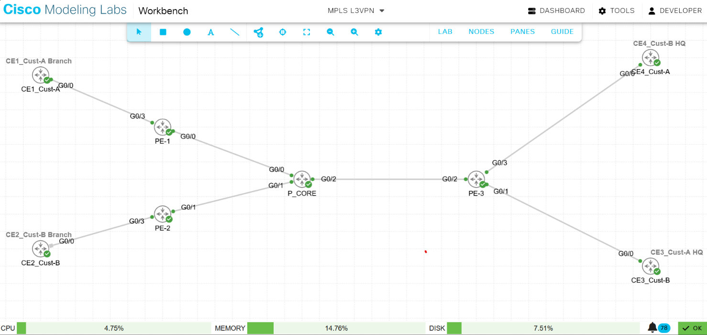

# Enterprise Multi-Tenant MPLS L3VPN Architecture

A production-ready **Multiprotocol Label Switching Layer 3 Virtual Private Network (MPLS L3VPN)** infrastructure designed in Cisco Modeling Labs (CML). This architecture simulates a core service provider backbone handling secure multi-tenant traffic isolation for two corporate clients with overlapping internal subnets.

## 🚀 Architectural Blueprint Layout


*   **Core Transport Backbone:** Scaled using a central **P_Core** transit router running **OSPF Area 0** for internal reachability and **LDP (Label Distribution Protocol)** for hop-by-hop hardware label switching.
*   **The Provider Edge (PE):** Implements **Virtual Routing and Forwarding (VRF)** to completely slice a single physical router into distinct virtual routing containers.
*   **The Signaling Control Plane:** Uses **Multiprotocol BGP (MP-BGP)** with the `vpnv4` address family to safely transmit extended community tags (Route Targets) across the core network directly between edge routers.

***

## 🛠️ Technology & Protocol Decoder

*   **VRF (Virtual Routing and Forwarding):** Isolates routing tables inside a single physical router to allow multi-tenant coexistence without data leakage.
*   **RD (Route Distinguisher):** An 8-byte tag added to standard IPv4 prefixes, transforming them into globally unique 96-bit VPNv4 addresses.
*   **RT (Route Target):** Extended BGP communities that dictate the structural import and export policies of VRF routing paths.
*   **LDP (Label Distribution Protocol):** Dynamically allocates and exchanges MPLS labels to bypass CPU-intensive layer-3 IP lookups.
*   **MP-BGP (Multiprotocol BGP):** The specialized signaling engine extended to route non-standard traffic profiles like `vpnv4` attributes.
*   **Loopback Interfaces:** Software-defined, permanent virtual interfaces deployed as stable anchors for core BGP peering sessions.

***

## ⚙️ Complete Configuration Script Engine

### 1. Provider Core Node (`P_Core`)
```routeros
hostname P_Core
interface loopback0
 ip address 1.1.1.1 255.255.255.255
exit
interface GigabitEthernet0/0
 ip address 10.12.1.2 255.255.255.0
 no shutdown
exit
interface GigabitEthernet0/1
 ip address 10.23.1.2 255.255.255.0
 no shutdown
exit
interface GigabitEthernet0/2
 ip address 10.34.1.2 255.255.255.0
 no shutdown
exit
router ospf 1
 network 1.1.1.1 0.0.0.0 area 0
 network 10.12.1.0 0.0.0.255 area 0
 network 10.23.1.0 0.0.0.255 area 0
 network 10.34.1.0 0.0.0.255 area 0
exit
mpls ip
mpls label protocol ldp
interface GigabitEthernet0/0
 mpls ip
exit
interface GigabitEthernet0/1
 mpls ip
exit
interface GigabitEthernet0/2
 mpls ip
end
```

### 2. Provider Edge 1 (`PE-1`)
```routeros
hostname PE-1
interface loopback0
 ip address 2.2.2.2 255.255.255.255
exit
ip vrf Customer_A
 rd 100:1
 route-target export 100:1
 route-target import 100:1
exit
interface GigabitEthernet0/0
 ip address 10.12.1.1 255.255.255.0
 no shutdown
exit
interface GigabitEthernet0/3
 ip vrf forwarding Customer_A
 ip address 192.168.12.1 255.255.255.0
 no shutdown
exit
ip route vrf Customer_A 192.168.1.0 255.255.255.0 192.168.12.2
router ospf 1
 network 2.2.2.2 0.0.0.0 area 0
 network 10.12.1.0 0.0.0.255 area 0
exit
mpls ip
mpls label protocol ldp
interface GigabitEthernet0/0
 mpls ip
exit
router bgp 100
 neighbor 4.4.4.4 remote-as 100
 neighbor 4.4.4.4 update-source loopback0
 address-family vpnv4
  neighbor 4.4.4.4 activate
  neighbor 4.4.4.4 send-community extended
 exit
 address-family ipv4 vrf Customer_A
  redistribute static
 end
```

### 3. Provider Edge 2 (`PE-2`)
```routeros
hostname PE-2
interface loopback0
 ip address 3.3.3.3 255.255.255.255
exit
ip vrf Customer_B
 rd 200:1
 route-target export 200:1
 route-target import 200:1
exit
interface GigabitEthernet0/1
 ip address 10.23.1.1 255.255.255.0
 no shutdown
exit
interface GigabitEthernet0/3
 ip vrf forwarding Customer_B
 ip address 192.168.24.1 255.255.255.0
 no shutdown
exit
ip route vrf Customer_B 192.168.2.0 255.255.255.0 192.168.24.2
router ospf 1
 network 3.3.3.3 0.0.0.0 area 0
 network 10.23.1.0 0.0.0.255 area 0
exit
mpls ip
mpls label protocol ldp
interface GigabitEthernet0/1
 mpls ip
exit
router bgp 100
 neighbor 4.4.4.4 remote-as 100
 neighbor 4.4.4.4 update-source loopback0
 address-family vpnv4
  neighbor 4.4.4.4 activate
  neighbor 4.4.4.4 send-community extended
 exit
 address-family ipv4 vrf Customer_B
  redistribute static
 end
```

### 4. Shared Provider Edge 3 (`PE-3`)
```routeros
hostname PE-3
interface loopback0
 ip address 4.4.4.4 255.255.255.255
exit
ip vrf Customer_A
 rd 100:1
 route-target export 100:1
 route-target import 100:1
exit
ip vrf Customer_B
 rd 200:1
 route-target export 200:1
 route-target import 200:1
exit
interface GigabitEthernet0/2
 ip address 10.34.1.1 255.255.255.0
 no shutdown
exit
interface GigabitEthernet0/3
 ip vrf forwarding Customer_A
 ip address 192.168.36.1 255.255.255.0
 no shutdown
exit
interface GigabitEthernet0/4
 ip vrf forwarding Customer_B
 ip address 192.168.47.1 255.255.255.0
 no shutdown
exit
ip route vrf Customer_A 192.168.3.0 255.255.255.0 192.168.36.2
ip route vrf Customer_B 192.168.4.0 255.255.255.0 192.168.47.2
router ospf 1
 network 4.4.4.4 0.0.0.0 area 0
 network 10.34.1.0 0.0.0.255 area 0
exit
mpls ip
mpls label protocol ldp
interface GigabitEthernet0/2
 mpls ip
exit
router bgp 100
 neighbor 2.2.2.2 remote-as 100
 neighbor 2.2.2.2 update-source loopback0
 neighbor 3.3.3.3 remote-as 100
 neighbor 3.3.3.3 update-source loopback0
 address-family vpnv4
  neighbor 2.2.2.2 activate
  neighbor 2.2.2.2 send-community extended
  neighbor 3.3.3.3 activate
  neighbor 3.3.3.3 send-community extended
 exit
 address-family ipv4 vrf Customer_A
  redistribute static
 exit
 address-family ipv4 vrf Customer_B
  redistribute static
 end
```

### 5. Left Customer Nodes (`CE1` & `CE2`)
```routeros
hostname CE1_CustA_Branch
interface loopback0
 ip address 192.168.1.1 255.255.255.0
exit
interface GigabitEthernet0/0
 ip address 192.168.12.2 255.255.255.0
 no shutdown
exit
ip route 0.0.0.0 0.0.0.0 192.168.12.1
end
```
```routeros
hostname CE2_CustB_Branch
interface loopback0
 ip address 192.168.2.1 255.255.255.0
exit
interface GigabitEthernet0/0
 ip address 192.168.24.2 255.255.255.0
 no shutdown
exit
ip route 0.0.0.0 0.0.0.0 192.168.24.1
end
```

### 6. Right Customer Nodes (`CE3` & `CE4`)
```routeros
hostname CE3_CustA_HQ
interface loopback0
 ip address 192.168.3.1 255.255.255.0
exit
interface GigabitEthernet0/0
 ip address 192.168.36.2 255.255.255.0
 no shutdown
exit
ip route 0.0.0.0 0.0.0.0 192.168.36.1
end
```
```routeros
hostname CE4_CustB_HQ
interface loopback0
 ip address 192.168.4.1 255.255.255.0
exit
interface GigabitEthernet0/0
 ip address 192.168.47.2 255.255.255.0
 no shutdown
exit
ip route 0.0.0.0 0.0.0.0 192.168.47.1
end
```

***

## 📊 Infrastructure Verification & Validation Logs

### 1. MPLS Core Operational Verification
```routeros
P_Core# show mpls interfaces
Interface                  IP            Tunnel   BGP Static Operational
GigabitEthernet0/0         Yes           No       No  No     Yes        
GigabitEthernet0/1         Yes           No       No  No     Yes        
GigabitEthernet0/2         Yes           No       No  No     Yes        
```

### 2. End-to-End Data Plane Reachability (Success Matrix)
```routeros
CE1_CustA_Branch# ping 192.168.3.1 source loopback0
Type escape sequence to abort.
Sending 5, 100-byte ICMP Echos to 192.168.3.1, timeout is 2 seconds:
Packet sent with a source address of 192.168.1.1 
!!!!!
Success rate is 100 percent (5/5), round-trip min/avg/max = 3/3/4 ms
```

### 3. Inter-VRF Traffic Isolation Verification (Security Proof)
```routeros
CE1_CustA_Branch# ping 192.168.4.1 source loopback0
Type escape sequence to abort.
Sending 5, 100-byte ICMP Echos to 192.168.4.1, timeout is 2 seconds:
Packet sent with a source address of 192.168.1.1 
.....
Success rate is 0 percent (0/5)
```
*Validation:* This confirms complete multi-tenant infrastructure security. Customer A cannot cross-communicate with Customer B under any circumstances.

***

## 👨‍💻 Production Interview Talk-Tracks

When a recruiter asks you to explain this lab, structure your response into three clear steps:

1.  **The Objective:** *"I built a scalable multi-tenant carrier infrastructure using MPLS L3VPN. This allows an ISP to safely combine multiple separate enterprise clients onto a single core infrastructure without risking data overlap or security leaks."*
2.  **The Engineering Strategy:** *"I isolated the customer routing paths right at the edge using VRFs, RDs, and Route Targets. I then linked those edge devices together using MP-BGP VPNv4 peering sessions sourced from stable Loopback interfaces, completely decoupling the control plane from the physical core."*
3.  **The Proof:** *"I proved it was production-ready by confirming 100% data plane connectivity between remote office sites of the same tenant, while validating a 0% leak factor when trying to ping across different tenants."*
